# Building Your First Theme

Welcome! This guide walks you through creating a custom countdown theme for Timestamp. By the end, you'll have a working theme that you can share with the world.

**Time to complete:** ~30 minutes

---

## What You'll Build

Themes are the centerpiece of Timestamp. Each theme controls how the countdown looks—from simple digital displays to elaborate animated experiences.

```mermaid
flowchart LR
    subgraph YourTheme["🎨 Your Theme"]
        Time[Time Display]
        Celebration[Celebration]
        Background[Landing Background]
        A11yImpl[Accessibility Implementation]
    end
    
    subgraph App["⚙️ App Provides"]
        Timer[Countdown Timer]
        State[State Management]
        A11yHooks[Accessibility Hooks & Foundations]
    end
    
    App -->|"updateTime(), onCelebrating(), onAnimationStateChange()"| YourTheme
```



**You focus on visuals and implementing accessibility hooks. The app provides timing, state, and accessibility foundations.**

The orchestrator manages timing and state, provides accessibility foundations (reduced motion detection, screen reader announcements, container ARIA attributes), then calls your theme's methods when it's time to render or respond to state changes. This separation means you can build wildly creative themes without worrying about countdown logic, while ensuring consistent accessibility across all themes.

---

## Quick Start: Your Theme in 5 Minutes

### Step 1: Generate the Scaffold

```bash
npm run theme create my-awesome-theme yourgithubusername
```

This single command creates everything you need:

| What's Created | Purpose |
|----------------|---------|
| Theme folder structure | Organized files ready to customize |
| Registry entry | Your theme appears in the theme selector and benefits from automatic generation of preview images, videos, and READMEs |
| Unit tests | Pre-configured test files |
| E2E test | Mobile viewport test ready to run |

### Step 2: See It Running

```bash
npm run dev
```

Open: `http://localhost:5173/?mode=timer&duration=30&theme=my-awesome-theme`

🎉 **You now have a working theme.** The rest of this guide explains how to customize it.

### Step 3: Generate Preview Images and Videos

```bash
npm run generate:previews -- --theme=my-awesome-theme
```

This generates both preview images AND animated video previews for the theme selector. The videos show your theme counting down and celebrating, giving users a preview of the experience before selecting your theme.

Output files in `src/themes/my-awesome-theme/images/`:
- `preview-dark.webm` / `preview-light.webm` — Animated video previews (~5s, shows countdown→celebration)
- `preview-dark-card-1x.webp` / `preview-light-card-1x.webp` — Card images (426×240)
- `preview-dark-card-2x.webp` / `preview-light-card-2x.webp` — Retina card images (852×480)

#### Optional: Video Compression with ffmpeg

For complex themes with many animations (like Fireworks), videos can be 500KB+. Installing ffmpeg enables automatic compression that typically reduces file sizes by 40-60%:

```bash
# macOS (with Homebrew)
brew install ffmpeg

# Ubuntu/Debian
sudo apt install ffmpeg

# Windows (with Chocolatey)
choco install ffmpeg
```

The generator will automatically use ffmpeg if available. Without ffmpeg, videos still work but are larger.

## Understanding Your Theme's Structure

Here's what the scaffold created:

```mermaid
flowchart TB
    subgraph ThemeFolder["src/themes/my-awesome-theme/"]
        Index["index.ts<br/>━━━━━━━━━<br/>Exports only"]
        
        subgraph Config["config/"]
            ConfigFile["index.ts — Theme metadata"]
        end
        
        subgraph Renderers["renderers/"]
            TPR["time-page-renderer.ts<br/>━━━━━━━━━━━━━━━━━<br/>Countdown display"]
            LPR["landing-page-renderer.ts<br/>━━━━━━━━━━━━━━━━━<br/>Landing background"]
        end
        
        subgraph Utils["utils/ui/"]
            Builder["ui-builder.ts — DOM helpers"]
        end
        
        Styles["styles.css — Theme styles"]
    end
    
    Index --> Config
    Index --> Renderers
    Renderers --> Utils
```



### The Key Files

| File | What It Does | When to Edit |
|------|--------------|--------------|
| [renderers/time-page-renderer.ts](../src/themes/fireworks/renderers/time-page-renderer.ts) | Renders the countdown | **Primary focus** — this is your main canvas |
| [renderers/landing-page-renderer.ts](../src/themes/fireworks/renderers/landing-page-renderer.ts) | Animated background on landing page | When you want a custom preview animation |
| [config/index.ts](../src/themes/fireworks/config/index.ts) | Name, colors, metadata | To customize branding and colors |
| [styles.scss](../src/themes/fireworks/styles.scss) | Theme styles (SCSS) | For styling (animations, layout, colors) |
| index.ts | Re-exports only | **Don't add code here** — keep it clean |

> 💡 **Pro tip:** The `index.ts` file should only contain exports. All implementation lives in the `renderers/` folder.

---

## How Themes Work: The Lifecycle

Your theme responds to lifecycle events from the orchestrator. Think of it like callbacks—the app tells you *when* something happens, you decide *how* to render it.


### The Three States

| State | What's Happening | Your Theme Shows |
|-------|------------------|------------------|
| **Counting** | Timer running | Days, hours, minutes, seconds |
| **Celebrating** | Just hit zero | Animation + celebration message |
| **Celebrated** | Already past zero | Static celebration (no animation) |

### Why Two Celebration Methods?

- **`onCelebrating()`** — Timer *just* hit zero. Trigger your big animation (or not, it's up to you)!
- **`onCelebrated()`** — User switched to a timezone that's already past midnight. Show the end state instantly.

## Customizing Your Theme

Now let's make your theme unique. We'll walk through each part of the `TimePageRenderer`.

### The Renderer Interface

Your theme implements this interface. The scaffold provides all methods, and you customize your implementations.


See the full interface in [src/core/types/index.ts](../src/core/types/index.ts).

### 1. Mount: Setting Up Your UI

The `mount()` method creates your theme's DOM structure. The scaffold generates a working implementation—customize the HTML to match your vision.

**What to do:**
- Build your DOM elements
- Apply initial styles
- Call `context.getAnimationState()` to check animation state (includes `prefersReducedMotion` and `shouldAnimate`)

📖 **Simple example:** [Fireworks time-page-renderer.ts](../src/themes/fireworks/renderers/time-page-renderer.ts)  
📖 **Complex example:** [Contribution Graph time-page-renderer.ts](../src/themes/contribution-graph/renderers/time-page-renderer.ts)

### 2. Update Time: The Heartbeat

`updateTime()` is called every second during countdown.

```typescript
interface TimeRemaining {
  days: number;
  hours: number;
  minutes: number;
  seconds: number;
  total: number;  // milliseconds remaining
}
```

**What to do:**
- Update your display elements with the new values
- Avoid unnecessary DOM writes (use helpers like `setTextIfChanged`)

📖 **Example:** See how [Fireworks updates its display](../src/themes/fireworks/renderers/time-page-renderer.ts)

### 3. Celebrations: The Big Moment

When the countdown ends, make it memorable!

**`onCelebrating(options)`** — This is an optional animation phase, you can choose to animate or not. Typical actions:
- Hide the countdown display
- Show the celebration message
- Trigger animations

**`onCelebrated(options)`** — Already past zero (no animation):
- Show the final celebration state immediately
- Skip any entrance animations

The `options` parameter contains the celebration message:

```typescript
interface CelebrationOptions {
  /** SafeMessage for rendering - use forTextContent or forInnerHTML */
  message?: SafeMessage;
  /** Full message for accessibility (plain text) */
  fullMessage?: string;
}
```

> ℹ️ **Safe by Design:** Messages are provided as `SafeMessage` objects. Use `message.forTextContent` for `element.textContent` (preferred) or `message.forInnerHTML` for `innerHTML`. Both are XSS-safe.

📖 **Example:** [Fireworks celebration handling](../src/themes/fireworks/renderers/time-page-renderer.ts)

### 4. Cleanup: Be a Good Citizen

The `destroy()` method must clean up everything—timers, observers, event listeners, DOM nodes.

**Use the shared cleanup utilities:**

```typescript
import { createResourceTracker, cancelAll } from '@themes/shared';
```

These track your resources and clean them up in one call. See [src/themes/shared/](../src/themes/shared/) for available helpers.

📖 **Example:** [How Fireworks handles cleanup](../src/themes/fireworks/renderers/time-page-renderer.ts)

---

## Required Test Selectors

E2E tests verify your theme works correctly. Include these `data-testid` attributes:

| Selector | Element | Required |
|----------|---------|----------|
| `theme-container` | Root theme element | ✅ |
| `countdown-display` | Countdown container | ✅ |
| `countdown-days` | Days value | ✅ |
| `countdown-hours` | Hours value | ✅ |
| `countdown-minutes` | Minutes value | ✅ |
| `countdown-seconds` | Seconds value | ✅ |
| `celebration-message` | Celebration text | ✅ |

The scaffold includes these automatically. Don't remove them!

## Styling Your Theme

### CSS Custom Properties

The app provides CSS custom properties for responsive layout and theming:

| Property | Purpose | Example Values |
|----------|---------|----------------|
| `--safe-area-top` | Space for top UI | `60px` |
| `--safe-area-bottom` | Space for bottom UI | `220px` desktop, `20px` mobile |
| `--font-scale` | Responsive text sizing | `1.0` desktop, `0.7` mobile |
| `--color-accent-primary` | Theme accent color | Your theme's primary color |

Use these to ensure your theme works across screen sizes:

```css
.my-countdown {
  padding-top: var(--safe-area-top);
  font-size: calc(4rem * var(--font-scale));
}
```

### Theme Colors

Define your colors in `config/index.ts`. The orchestrator applies them as CSS variables:

```typescript
colors: {
  dark: {
    accentPrimary: '#your-color',
    accentSecondary: '#your-secondary',
  },
  light: {
    accentPrimary: '#your-light-color',
    accentSecondary: '#your-light-secondary',
  },
}
```

📖 **Full color options:** See `ThemeColors` in [src/core/types/index.ts](../src/core/types/index.ts)

---

## Advanced: Canvas-Based Themes with Color Modes

If you're building a canvas-based theme that needs color-aware rendering (like Contribution Graph), you need to handle color mode initialization carefully.

### The Problem: Initialization Race Condition

When rendering to canvas on the **landing page**, you need the current color mode (light/dark) to set the correct palette. However, reading `data-color-mode` from the DOM can create a race condition:

```typescript
// ❌ WRONG: Reading from DOM during mount can be too early
function mount(container: HTMLElement, context?: MountContext): void {
  setupCanvas(container);
  // DOM attribute might not be set yet!
  const colorMode = document.documentElement.dataset.colorMode;
  renderer.setColorMode(colorMode || 'dark');
}
```

### The Solution: Use MountContext.colorMode

The `MountContext` provides a `colorMode` property that's guaranteed to be set before your renderer mounts:

```typescript
// ✅ CORRECT: Use colorMode from context
function mount(container: HTMLElement, context?: MountContext): void {
  setupCanvas(container, context?.colorMode);
  // Color mode is already resolved and passed in
}

function setupCanvas(container: HTMLElement, initialColorMode?: 'light' | 'dark'): void {
  const renderer = createCanvasRenderer();
  
  // Set color mode immediately if provided
  if (initialColorMode) {
    renderer.setColorMode(initialColorMode);
  } else {
    // Fallback for backward compatibility
    updateColorModeFromDOM();
  }
  
  container.appendChild(renderer.canvas);
}
```

### When This Matters

| Renderer Type | Needs colorMode? | Why |
|---------------|------------------|-----|
| **Landing page renderer** with canvas | ✅ Yes | Landing page initialization can race with color mode setup |
| **Time page renderer** with canvas | ⚠️ Optional | Time page is initialized after color mode is set, but using `context.colorMode` is still cleaner |
| **Simple DOM-based renderers** | ❌ No | CSS handles color modes automatically |

### Example: Contribution Graph

The Contribution Graph theme demonstrates this pattern:

📖 **Study:** [contribution-graph/renderers/landing-page-renderer.ts](../src/themes/contribution-graph/renderers/landing-page-renderer.ts)

Key points:
- `context.colorMode` is used during `mount()`
- The canvas renderer's palette is set immediately
- Fallback to DOM reading is kept for compatibility
- Color mode changes are still handled via event listeners

### Best Practices for Canvas Themes

1. **Always check `context?.colorMode` first** in your `mount()` method
2. **Set color mode before rendering** to prevent flashes
3. **Keep DOM reading as fallback** for time page renderers
4. **Listen for color-mode-change events** to handle user toggles

```typescript
// Complete pattern
export function myCanvasLandingPageRenderer(_container: HTMLElement): LandingPageRenderer {
  let renderer: CanvasRenderer | null = null;
  
  return {
    mount(container: HTMLElement, context?: MountContext): void {
      renderer = createCanvasRenderer();
      
      // 1. Use color mode from context (landing page)
      if (context?.colorMode) {
        renderer.setColorMode(context.colorMode);
      } else {
        // 2. Fallback to DOM (time page or older orchestrators)
        const domColorMode = document.documentElement.dataset.colorMode;
        renderer.setColorMode(domColorMode === 'light' ? 'light' : 'dark');
      }
      
      // 3. Listen for color mode changes
      document.addEventListener('color-mode-change', handleColorModeChange);
      
      container.appendChild(renderer.canvas);
    },
    
    destroy(): void {
      document.removeEventListener('color-mode-change', handleColorModeChange);
      renderer?.destroy();
    },
  };
}
```

## Accessibility: Non-Negotiable

Your theme must be accessible. The orchestrator provides accessibility hooks and foundations (container ARIA attributes via `setupThemeContainer()`, screen reader announcements via `AccessibilityManager`, reduced motion detection via `reducedMotionManager`). Themes must implement:

### 1. Animation State Management

Some users experience motion sickness or need animations paused. Implement the `onAnimationStateChange()` hook to respond to animation state changes:


The `context` parameter includes both `prefersReducedMotion` and `shouldAnimate` flags. Animations should run only when both conditions are met.

### 2. Color Contrast

| Text Type | Minimum Contrast |
|-----------|------------------|
| Normal text | 4.5:1 |
| Large text (18px+ bold, 24px+) | 3:1 |
| UI components | 3:1 |

Use [WebAIM Contrast Checker](https://webaim.org/resources/contrastchecker/) to verify.

## Testing Your Theme

### Run Unit Tests

```bash
npm run test -- my-awesome-theme
```

The scaffold creates test files alongside your source files. Add tests as you customize.

### Run E2E Tests

```bash
npm run test:e2e -- --grep "my-awesome-theme"
```

### Full Validation (Before Committing)

```bash
npm run validate:iteration
```

This runs: typecheck → lint → unit tests → build → E2E tests

> ⚠️ **Don't skip this.** CI will catch failures, but it's faster to catch them locally.

---

## Learning from Existing Themes

### 🎆 Fireworks — The Simple Example

**Best for learning:** Basic structure, canvas animations, cleanup patterns

**Key characteristics:**
- Single-file renderer (simpler to follow)
- Canvas-based animation
- Clear lifecycle handling

📖 **Study:** [src/themes/fireworks/](../src/themes/fireworks/)

### 📊 Contribution Graph — The Complex Example

**Best for learning:** Modular architecture, advanced state management, performance optimization

**Key characteristics:**
- Multiple coordinated modules
- DOM-based grid rendering
- Sophisticated animation staging

📖 **Study:** [src/themes/contribution-graph/](../src/themes/contribution-graph/)

### When to Use Which Pattern

| Your Theme Has | Study |
|----------------|-------|
| Simple animations | Fireworks |
| Canvas rendering | Fireworks |
| Complex DOM structure | Contribution Graph |
| Multiple animation systems | Contribution Graph |
| State that changes over time | Contribution Graph |

---

## Common Pitfalls

Avoid these mistakes that trip up new theme developers:

| ❌ Don't | ✅ Do Instead |
|----------|---------------|
| Create your own timers | Use `updateTime()` — the orchestrator handles timing |
| Subscribe to reduced motion directly | Implement `onAnimationStateChange()` hook |
| Put code in `index.ts` | Keep `index.ts` as exports only; code goes in `renderers/` |
| Forget cleanup in `destroy()` | Use `cancelAll()` from `@themes/shared` |
| Hardcode theme IDs | Use registry utilities like `isValidThemeId()` |
| Skip `updateContainer()` | Re-query DOM refs when the container moves |
| Remove `data-testid` attributes | Tests depend on them |

---

## Pre-Submission Checklist

Before contributing your theme, verify:

### Files
- [ ] `index.ts` exports only (no implementation)
- [ ] `renderers/time-page-renderer.ts` implements full interface
- [ ] `renderers/landing-page-renderer.ts` implements background
- [ ] `config/index.ts` has complete metadata
- [ ] `styles.css` has your styles
- [ ] `images/` folder has preview images AND videos (run `npm run generate:previews -- --theme=your-theme`)

### Functionality
- [ ] All `data-testid` selectors present
- [ ] `destroy()` cleans up all resources
- [ ] `onAnimationStateChange()` responds to reduced motion and animation state
- [ ] Colors work in both light and dark modes

### Quality
- [ ] `npm run validate:iteration` passes
- [ ] Tested on mobile viewport
- [ ] No flashing faster than 3/second
- [ ] Text meets contrast requirements

---

## Quick Reference

### Commands

| Command | Purpose |
|---------|---------|
| `npm run theme create <name> <author>` | Generate new theme |
| `npm run dev` | Start dev server |
| `npm run generate:previews -- --theme=<name>` | Generate preview images and videos |
| `npm run test -- <theme-name>` | Run theme's unit tests |
| `npm run validate:iteration` | Full validation |

### Key Imports

```typescript
// Types
import type { TimePageRenderer, TimeRemaining, CelebrationOptions, SafeMessage } from '@core/types';

// Cleanup utilities
import { createResourceTracker, cancelAll } from '@themes/shared';

// Time formatting
import { padTimeUnit } from '@core/time';
```

### File Locations

| What | Where |
|------|-------|
| Your theme | `src/themes/my-awesome-theme/` |
| Type definitions | [src/core/types/index.ts](../src/core/types/index.ts) |
| Shared utilities | [src/themes/shared/](../src/themes/shared/) |
| Registry | [src/themes/registry/](../src/themes/registry/) |
| Fireworks (simple) | [src/themes/fireworks/](../src/themes/fireworks/) |
| Contribution Graph (complex) | [src/themes/contribution-graph/](../src/themes/contribution-graph/) |

---

## Next Steps

1. **Customize your renderer** — Make `updateTime()` display something unique
2. **Add animations** — But respect reduced motion!
3. **Style it** — Use CSS custom properties for responsiveness
4. **Test it** — Run `validate:iteration` before committing
5. **Share it** — Open a PR!

📖 **Architecture deep-dive:** [ARCHITECTURE.md](ARCHITECTURE.md)  
📖 **Contributing guidelines:** [CONTRIBUTING.md](../CONTRIBUTING.md)  
📖 **URL parameters:** [DEEP-LINKING.md](DEEP-LINKING.md)

---

**Questions?** Open an issue or check existing themes for patterns. Welcome to the project! 🎉
