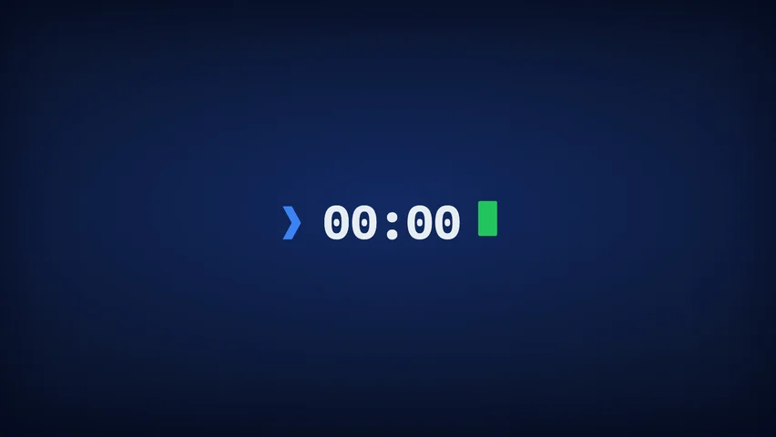

<!-- Auto-generated by scripts/theme-sync/readmes.ts - DO NOT EDIT MANUALLY -->

# Chris Reddington

> On-brand countdown with a seamless cursor-centred handoff into the intro motion system

<picture>
  <source media="(prefers-color-scheme: dark)" srcset="./images/preview-dark-card-2x.webp">
  <source media="(prefers-color-scheme: light)" srcset="./images/preview-light-card-2x.webp">
  
</picture>

## Metadata

| Property | Value |
|----------|-------|
| **Theme ID** | `chrisreddington` |
| **Published** | 2026-06-16 |
| **Author** | [@chrisreddington](https://github.com/chrisreddington) |
| **World Map Support** | No |
| **Tags** | chrisreddington, brand, cursor |

## Quick Demo Links

Try this theme with different countdown modes:

### 🏠 Local Time — *Wall clock* (Per timezone)
- [New Year 2027](https://chrisreddington.com/timestamp?mode=wall-clock&target=2027-01-01T00:00:00&theme=chrisreddington)
- [Valentine's Day 2027](https://chrisreddington.com/timestamp?mode=wall-clock&target=2027-02-14T00:00:00&theme=chrisreddington)

### 🌐 Same Moment — *Absolute time* (One instant globally)
- [Product Launch (July 16, 2026 at 00:00 UTC)](https://chrisreddington.com/timestamp?mode=absolute&target=2026-07-16T00:00:00Z&theme=chrisreddington&message=Launch%20Day!)

### ⏱️ Timer — *Your countdown* (Fixed duration)
- [5 Minute Timer](https://chrisreddington.com/timestamp?mode=timer&duration=300&theme=chrisreddington)
- [30 Second Demo](https://chrisreddington.com/timestamp?mode=timer&duration=30&theme=chrisreddington)

## Related Documentation

- [Theme Development Guide](../../docs/THEME_DEVELOPMENT.md)
- [Deep Linking Reference](../../docs/DEEP-LINKING.md)
- [Project README](../../README.md)
